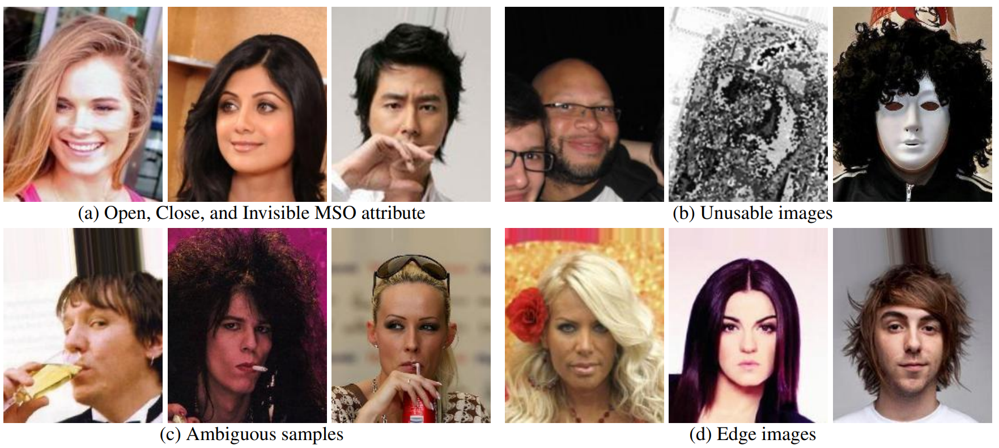

# Consistency and Accuracy of CelebA Attribute Values
## Paper accepted to the IEEE Conference on Computer Vision and Pattern Recognition Workshop (CVPRW) 2023
<figure>
  
  <figcaption>Figure 1: Examples of three annotations options, unusable images, ambiguous images, and edge images of Mouth Slightly Open (MSO) attribute.</figcaption>
</figure>

## TL;DR
This repository provides an MSO attribute cleaned version of CelebA.

## Paper details
[Haiyu Wu](https://haiyuwu.netlify.app/), Grace Bezold, Manuel Günther, Terrance Boult, Michael C. King, [Kevin W. Bowyer](https://www3.nd.edu/~kwb/), "*Consistency and Accuracy of CelebA Attribute Values*", CVPRW, 2023, [arXiv:2210.07356](https://arxiv.org/abs/2210.07356)

### Abstract
> We report the first systematic analysis of the experimental foundations of facial attribute classification. Two annotators independently assigning attribute values shows that only 12 of 40 common attributes are assigned values with ≥ 95% consistency, and three (high cheekbones, pointed nose, oval face) have essentially random consistency.  Of 5,068 duplicate face appearances in CelebA, attributes have contradicting values on from 10 to 860 of the 5,068 duplicates. Manual audit of a subset of CelebA estimates error rates as high as 40% for (no beard=false), even though the labeling consistency experiment indicates that no beard could be assigned with ≥ 95% consistency. Selecting the mouth slightly open (MSO) for deeper analysis, we estimate the error rate for (MSO=true) at about 20% and (MSO=false) at about 2%. A corrected version of the MSO attribute values enables learning a model that achieves higher accuracy than previously reported for MSO.

### Citation
If you use any part of our code or data, please cite our paper.
```
@article{wu2022consistency,
  title={Consistency and Accuracy of CelebA Attribute Values},
  author={Wu, Haiyu and Bezold, Grace and G{\"u}nther, Manuel and Boult, Terrance and King, Michael C and Bowyer, Kevin W},
  journal={arXiv preprint arXiv:2210.07356},
  year={2022}
}
```
### Dataset Cleaning
The statistic information is shown in this table. Note that, for label value, **only MSO is cleaned in this paper.**

|          |  Train  |  Val   |  Test  | Info_not_vis | Unusable | NMSO           | MSO            |
| -------- | :-----: | :----: | :----: | :----------: | :------: | :--------------: | :--------------: |
| Original | 162,770 | 19,867 | 19,962 |      -       |    -     | 104,657(51.7%) | 97,942(48.3%)  |
| Cleaned  | 161,982 | 19,741 | 19,913 |     797      |   166    | 73,701(36.6%)  | 127,932(63.4%) |

You can download cleaned labels [here](./cleaned_mso_labels/label_cleaned_mso.csv).

### Accuracy
| Train/Val/Test             | AFFACT | MOON  | ResNet50 | DenseNet121 |
| -------------------------- | :------: | :-----: | :--------: | :-----------: |
| Original/Original/Original | 94.16  | 94.09 | 93.95    | 94.10       |
| Original/Original/Cleaned  | 85.17  | 85.94 | 85.24    | 85.98       |
| Original/Cleaned/Cleaned   | 86.17  | 86.49 | 86.54    | 85.69       |
| Cleaned/Cleaned/Original   | 86.13  | 85.40 | 85.90    | 85.27       |
| Cleaned/Cleaned/Cleaned    | 95.18  | 95.49 | 95.33    | 95.15       |

Models are available in [Model zoo](https://drive.google.com/drive/folders/1RZ-OTYpfnE4ms3Kwg-HcZB2hbYYA71oc?usp=sharing)

### Test
#### Data preparation
Download the cropped and aligned [CelebA](http://mmlab.ie.cuhk.edu.hk/projects/CelebA.html) and run the script to get the dataset.
```
python drop_noise_ims.py -s /path/to/celeba/ims -f ./cleaned_mso_labels/partition.csv -d ./dataset
```

Download the weights from [model zoo](https://drive.google.com/drive/folders/1RZ-OTYpfnE4ms3Kwg-HcZB2hbYYA71oc?usp=sharing) and run the script.
```
python test.py -m /path/to/weights -i ./dataset/test/ -l ./cleaned_mso_labels/label_cleaned_mso.csv
```
